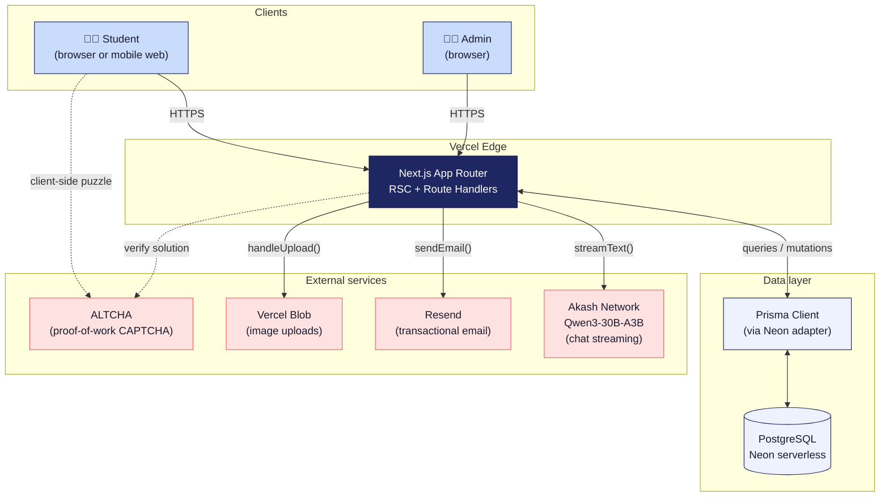

# 01 — System architecture

The whole stack on one page. Use this when you're trying to figure out where a piece of work lives, or which service is responsible for a given concern.

## Diagram

## Notes

- **Everything goes through Next.js.** There is no separate API service. Route handlers (`app/api/**/route.ts`) and Server Components share the same `lib/prisma.ts` client.
- **Neon's serverless Postgres scales to zero.** Cold starts can add ~100–300 ms but cost is essentially zero when idle.
- **Akash is the only AI dependency.** Switching to OpenAI or Anthropic later means changing one file (`lib/akash.ts`) and the model string.
- **ALTCHA does NOT call our server during the puzzle.** The puzzle is solved entirely client-side; we only verify the proof on submit.
