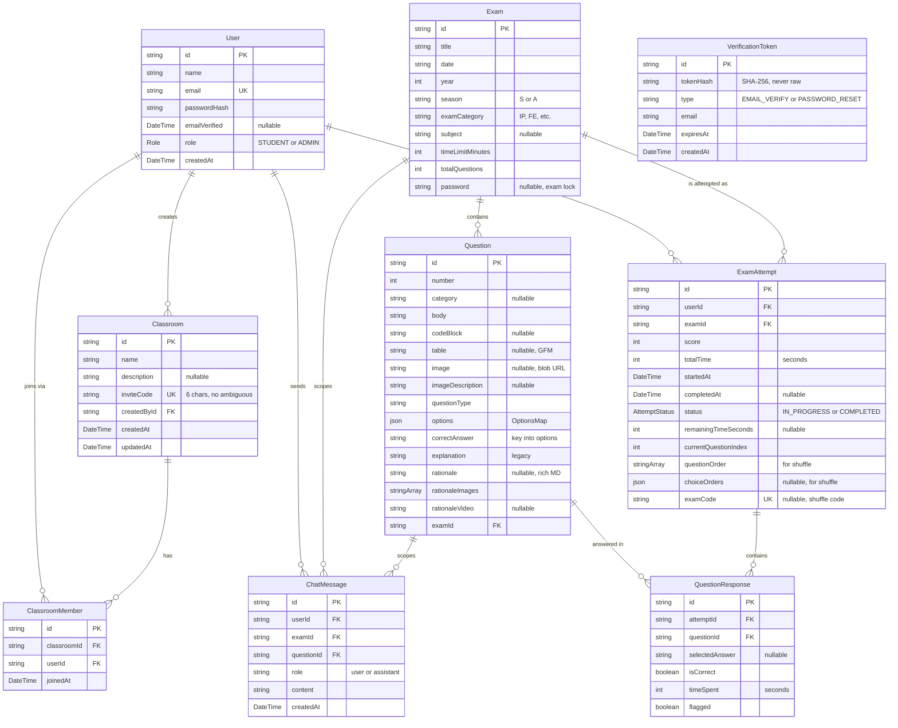

# 02 — Data model (ERD)

Every Prisma table and how they relate. The source of truth is `prisma/schema.prisma` — if this diagram drifts, fix the diagram.

## Diagram

## Notes

- **`VerificationToken` has no FK to `User`** — it identifies by email so password-reset works even if the user record's email gets updated mid-flow.
- **`options` is JSON, not separate columns** — the migration `20260215150000_options_json_column` consolidated `optionA..J` + hints into one `OptionsMap`. See `lib/question-options.ts`.
- **Per-question rows in `QuestionResponse`** make per-question analytics cheap. A single JSON blob per attempt would have made "which question is hardest?" much harder.
- **`questionOrder` and `choiceOrders`** are only populated for shuffled attempts. Empty → render in natural order.
- **`examCode` is unique** so a teacher can look up a specific shuffled variant.
