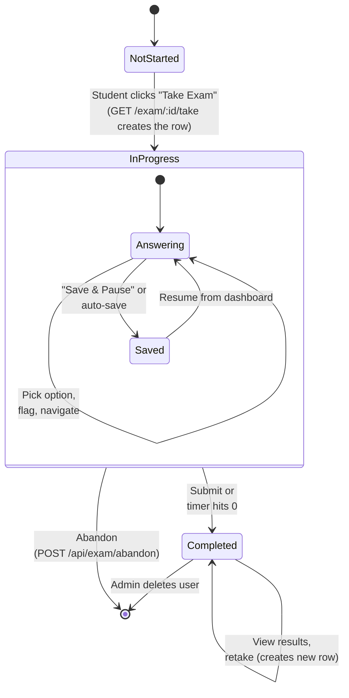
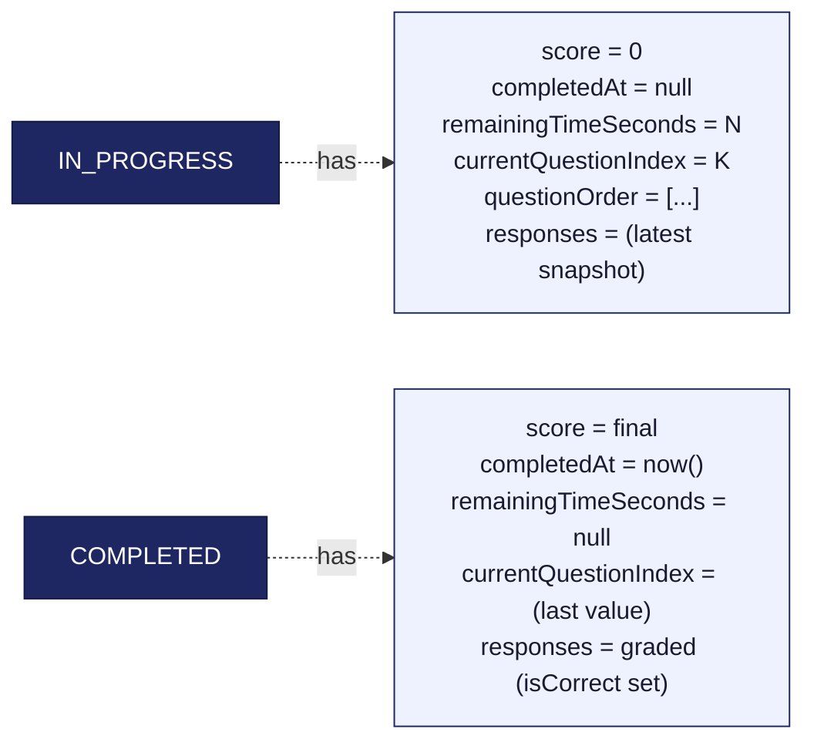

# 04 — Exam attempt states

How an `ExamAttempt` row moves through its lifecycle. Read this before touching anything in `/api/exam/*`.

## Diagram

## Stored fields per state

## Notes

- **There's no separate "saved" status** — saving just updates the existing `IN_PROGRESS` row. The `Saved` substate above is conceptual, not in the schema.
- **Abandon is a hard delete**, inside a transaction with `QuestionResponse.deleteMany`. We chose this over a soft `ABANDONED` status because abandoned attempts have zero analytical value and we don't want them polluting averages.
- **Submitting from an existing in-progress row** updates it in place. Submitting without an `attemptId` (rare, only if the row was lost) creates a new completed row directly.
- **Only one `IN_PROGRESS` row per (user, exam)** by convention. The take page looks for one with `findFirst({ status: IN_PROGRESS })` and resumes it; otherwise it creates one.
