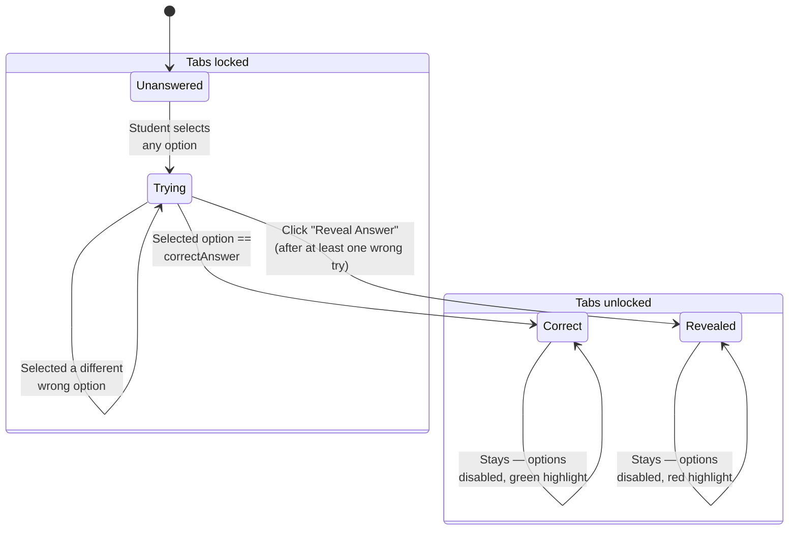

# 05 — Study mode question states

In Study Mode (`app/exam/[examId]/study/study-client.tsx`), each question has a status that drives UI color and whether the rationale/AI-chat tabs unlock.

Unlike Exam Mode, this state lives only in React — it's never persisted.

## Diagram

## UI mapping

| Status | Nav-grid color | Options interactive? | Rationale tab? | AI Chat tab? |
|---|---|---|---|---|
| `unanswered` | white / gray | yes | locked | locked |
| `trying` | amber | yes (still picking) | locked | locked |
| `correct` | green | no (settled) | unlocked | unlocked |
| `revealed` | red | no (settled) | unlocked | unlocked |

## Notes

- **The "settled" check is `correct || revealed`.** This is what unlocks the tabs.
- **Hint button is only enabled in `trying` state**, and only if the currently-selected wrong option has a hint string.
- **"Reset all" wipes everything back to Unanswered** without confirmation per question — it's a single confirm-dialog gate.
- **Status is derived, not stored** — `getStatus(qId)` looks up `correctSet`, `revealedSet`, and `answers` in order.
