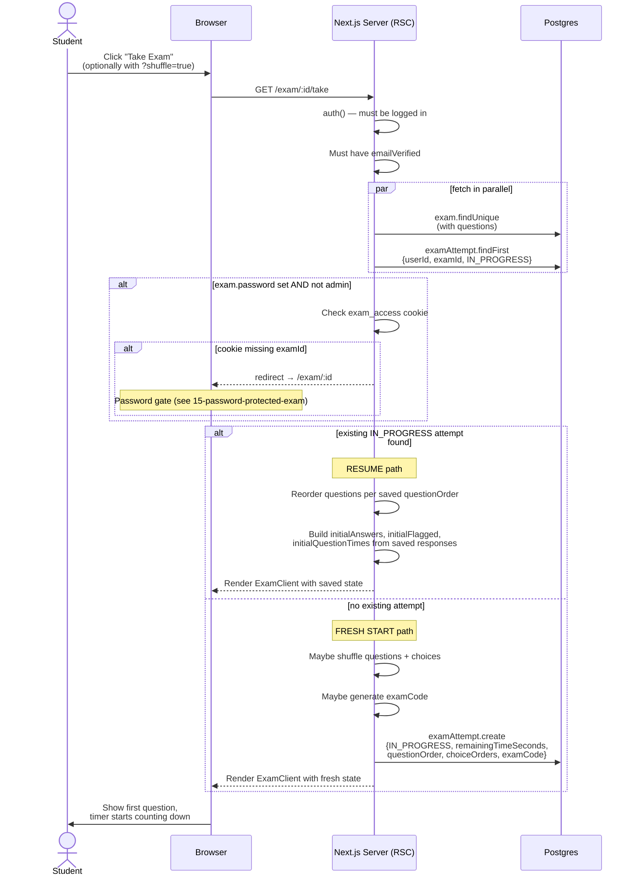

# 09 — Starting an exam

What happens when a verified student clicks "Take Exam" on an exam they've never started before. Code lives in `app/exam/[examId]/take/page.tsx`.

## Diagram

## Notes

- **`auth()` and `params`/`searchParams` are awaited in parallel** with `Promise.all` to avoid a serial waterfall. Saves 50–100ms.
- **The exam row is created server-side on render**, not on first answer. This means you'll see an `IN_PROGRESS` row even for a student who opens the page and leaves immediately. Abandon cleans these up.
- **The resume branch re-orders questions** to match the original shuffled order. Without this, a resumed shuffled attempt would suddenly show questions in a different order.
- **Admins bypass the password gate.** This is intentional — they need to be able to preview locked exams.
- **`displayNumber` is computed at render time** — for shuffled attempts it's the position (1-based), for natural-order it's `question.number`.
