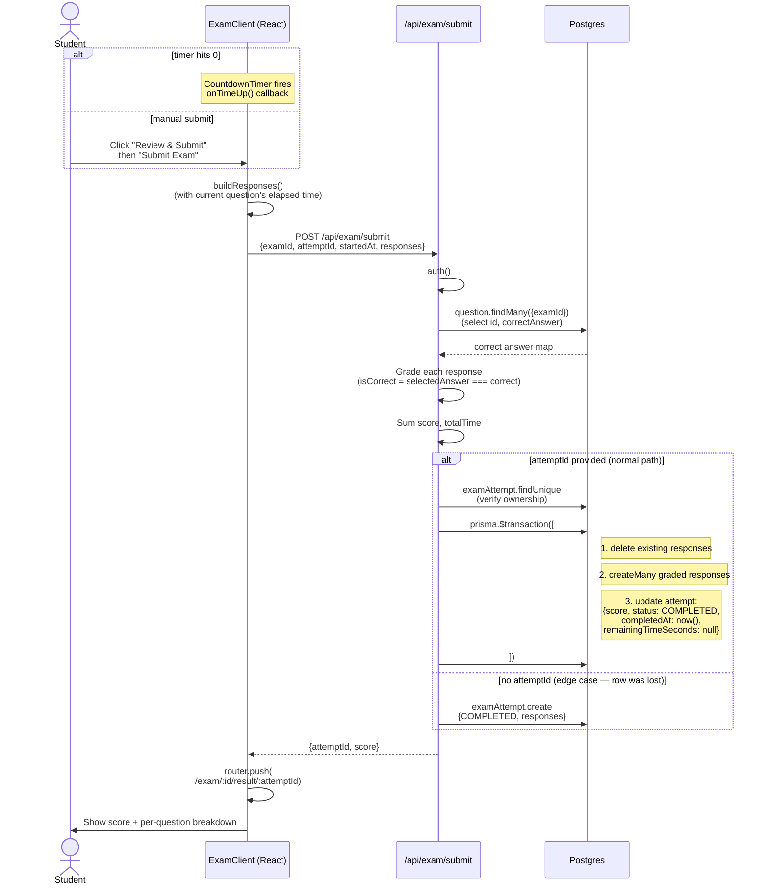

# 11 — Submit & grading

What happens when the student hits "Submit Exam" (or the timer runs out and auto-submits). Code lives in `app/api/exam/submit/route.ts`.

## Diagram

## Notes

- **Grading happens server-side, never client-side.** The client doesn't know the correct answers — that data is filtered out of the take-page query (`select` only includes question metadata, not `correctAnswer`).
- **Auto-submit on timeout** is fired by the `CountdownTimer` component's `onTimeUp` callback. A `firedRef` ensures it only fires once even if the interval ticks again.
- **The fallback `examAttempt.create` path** is for the case where someone submits without ever creating an in-progress row. In practice this shouldn't happen — the take page always creates one — but the code defends against it.
- **`completedAt` is set on the server side** with `new Date()`, not from the client. We don't trust client clocks for scoring or analytics.
- **The result page is its own route** so refreshing it doesn't accidentally re-submit. Idempotent by design.
