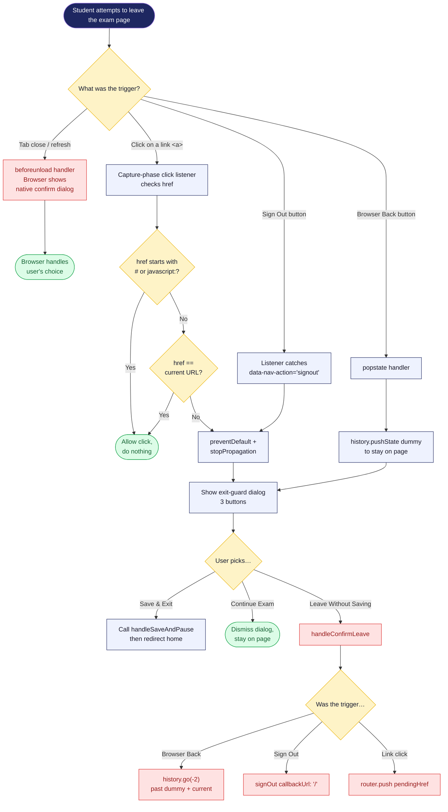

# 12 — Exit guard decision

The decision tree for `hooks/use-exam-exit-guard.ts`. This is the hook that prevents a student from accidentally throwing away 90 minutes of work.

## Diagram

## Notes

- **Capture-phase click listener** is critical. Bubble-phase would fire too late — Next.js's `Link` would have already started client-side navigation.
- **Pushing a dummy history state** lets us turn the Back button into "show dialog" without leaving. When the user confirms leaving, `history.go(-2)` skips past both the dummy AND the take-page entry.
- **The dialog can't be dismissed by clicking outside or pressing Escape.** Both are blocked in `AlertDialogContent` via `onPointerDownOutside`, `onEscapeKeyDown`, `onInteractOutside` preventDefault.
- **The hook is disabled when the page is already navigating away** (`enabled: !submitting && !saving`). Otherwise, programmatic navigation would trigger our own dialog.
- **Hash links (`#section`) and same-page links bypass the dialog.** Anchor clicks and self-links shouldn't trigger an exit warning.
