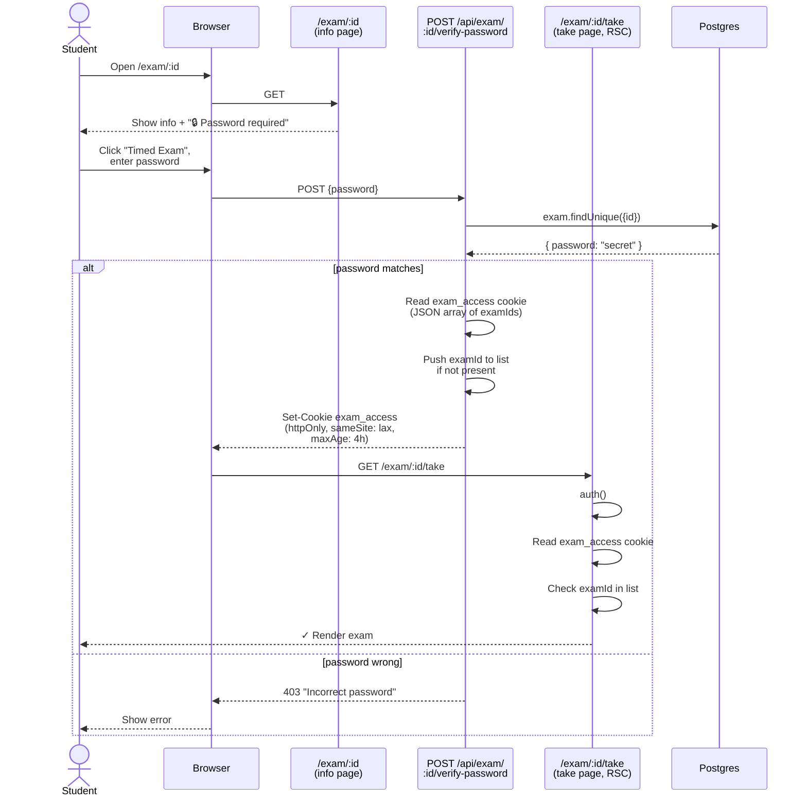
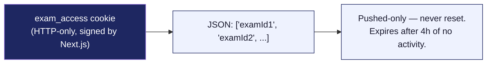

# 15 — Password-protected exam unlock

For exams with `exam.password` set, the student has to enter it before the take page will render. The unlock is cookie-based and lasts 4 hours.

## Diagram

## Cookie shape

## Notes

- **The take page also checks the cookie**, not just the verify endpoint. Defense in depth — even if someone manually navigates to `/exam/:id/take`, the cookie is required.
- **Admins bypass the password gate** in both the take and study pages. They need to preview locked exams.
- **The cookie is `httpOnly`** so JavaScript can't read or forge it. The same-site `lax` setting allows top-level navigations to carry it.
- **4-hour expiry** is intentional — long enough to span a single exam session (most are < 2 hours) plus a re-take or two, short enough that a shared computer doesn't leak access.
- **Multiple exams can be unlocked at once.** The cookie holds an array, not a single ID.
