# 16 — Role-based access control

How a single HTTP request gets authorized. There's no single middleware doing all of it — checks are layered at each level.

## Diagram

```mermaid
flowchart TD
  Req([Incoming request<br/>e.g. POST /api/admin/users]) --> MW[NextAuth middleware<br/>authorized callback in lib/auth.ts]

  MW --> Pub{Is route<br/>public?}
  Pub -->|Yes| Allow1([Allow])
  Pub -->|No| Logged{Has valid<br/>JWT?}

  Logged -->|No| Redirect[Redirect to /login<br/>?callbackUrl=...]
  Logged -->|Yes| Reach[Reach the handler]

  Reach --> Type{What kind of<br/>handler?}

  Type -->|Server Component| RSC[Page calls auth&#40;&#41;<br/>at top]
  Type -->|Route Handler| API[Handler calls auth&#40;&#41;<br/>first line]

  RSC --> RSCCheck{Role check?<br/>e.g. role !== ADMIN}
  RSCCheck -->|Fails| RSCRedirect[redirect&#40;'/dashboard'&#41;]
  RSCCheck -->|Passes| RSCRender[Render page]

  API --> APICheck{Role check?<br/>e.g. role !== ADMIN}
  APICheck -->|Fails| API401[Return 401/403]
  APICheck -->|Passes| Verify{Needs email<br/>verified?<br/>e.g. /api/chat}
  Verify -->|Yes, not verified| API403[Return 403]
  Verify -->|Yes, verified or no check| Owner{Owns the<br/>resource?<br/>e.g. attempt.userId === session.user.id}
  Owner -->|No| API404[Return 404<br/>or 403]
  Owner -->|Yes| Run([Execute handler])

  classDef start fill:#1E2761,color:#FFFFFF
  classDef decision fill:#FEF3C7,color:#1A1A2E,stroke:#EAB308
  classDef allow fill:#DCFCE7,color:#166534,stroke:#16A34A
  classDef deny fill:#FEE2E2,color:#991B1B,stroke:#DC2626
  classDef action fill:#EEF2FE,color:#1A1A2E,stroke:#1E2761

  class Req start
  class Pub,Logged,Type,RSCCheck,APICheck,Verify,Owner decision
  class Allow1,Run,RSCRender allow
  class Redirect,RSCRedirect,API401,API403,API404 deny
  class MW,Reach,RSC,API action
```

## Why so many layers

| Layer | Reason |
|---|---|
| Middleware (`authorized` callback) | Cheap early reject for unauthenticated requests on protected routes. |
| Page-level `auth()` + role check | UI shouldn't even render for unauthorized users — avoids flicker. |
| API-level `auth()` + role check | Never trust the client. The page check can be bypassed by hitting the API directly. |
| Resource ownership check (`attempt.userId === session.user.id`) | Role-checked endpoints still need IDOR protection — being a student doesn't mean you own *this* attempt. |
| `emailVerified` check on `/api/chat` & `/api/exam/take` | Specific routes that cost money or have abuse potential. |

## Notes

- **Admins do NOT automatically own everything.** The admin-only endpoints have their own role check, but for student-owned resources (attempts, classroom memberships) we use specific admin endpoints rather than letting admins use student endpoints with any userId.
- **Return 404 instead of 403 for ownership failures** — don't leak existence of resources.
- **The `authorized` callback in `lib/auth.ts`** is for the middleware's redirect-or-allow decision. Per-handler checks are separate and more granular.
