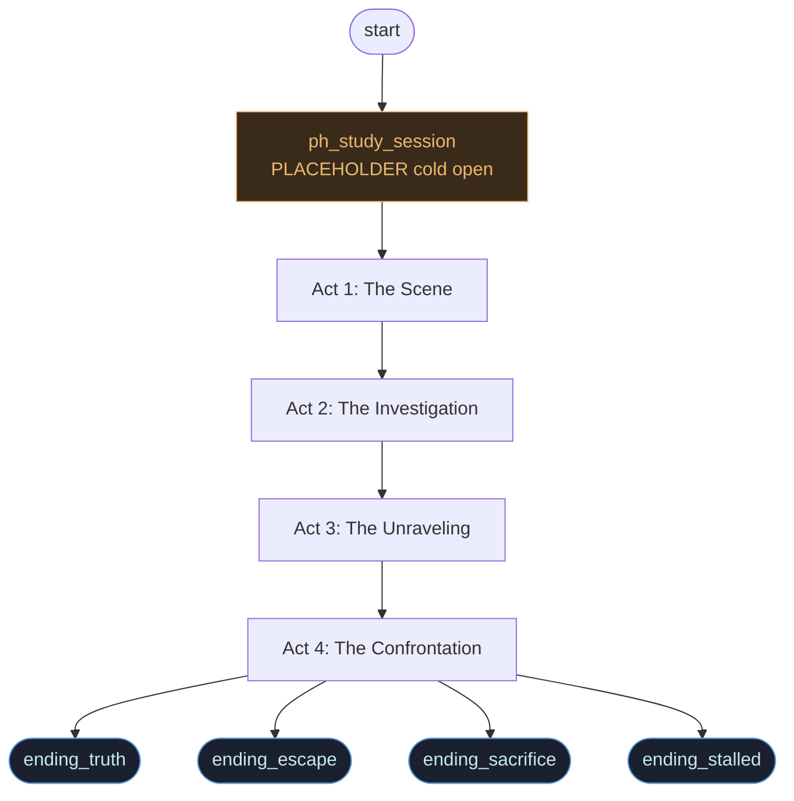
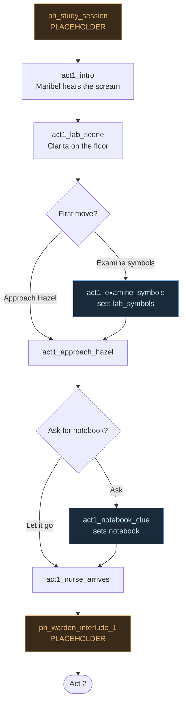
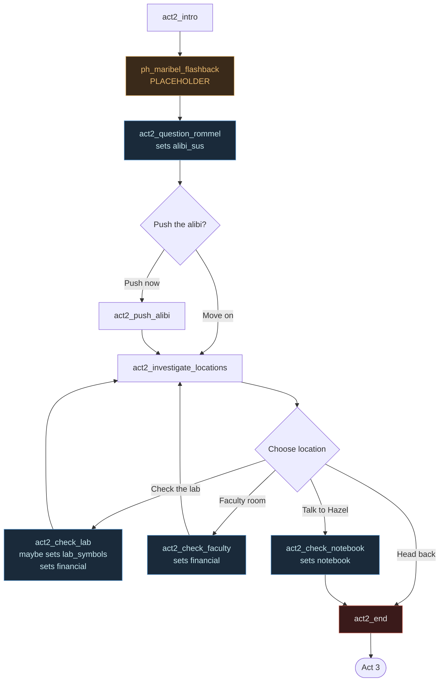
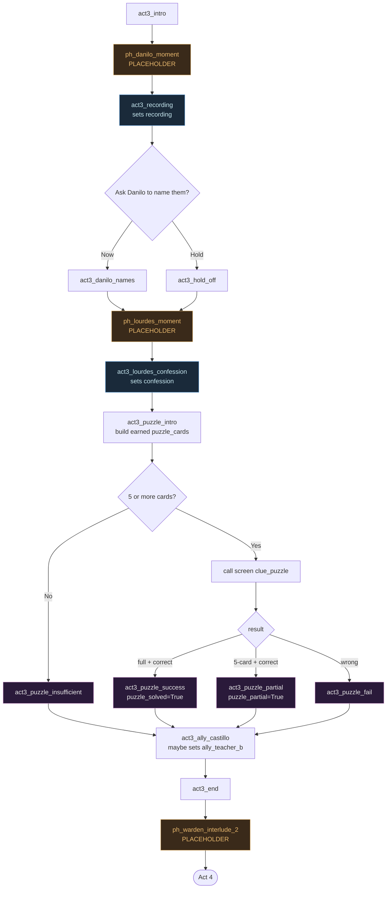
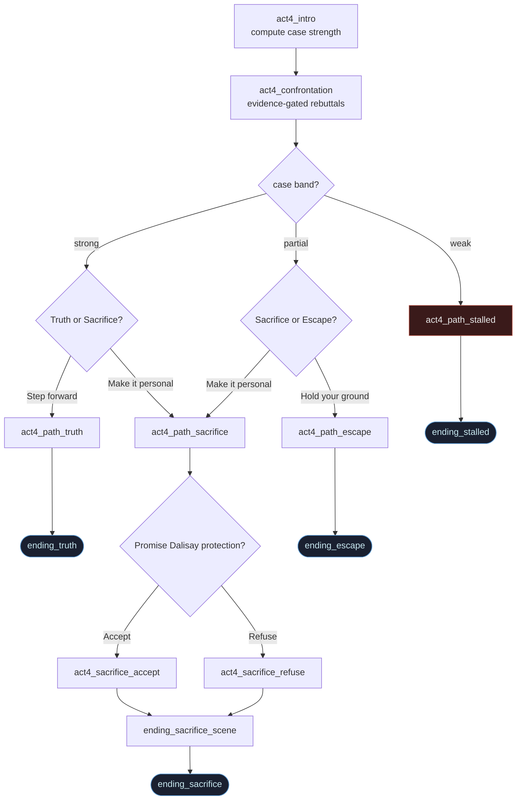

# 01 - Story Flow

Five charts: the top-level four-act spine, then each act with its branches,
choices, clue-setters, and placeholder labels.

## 1. Top-level four-act spine

The skeleton every playthrough follows. The four endings are reachable from
Act 4 based on case strength (see `02-clues-and-case-strength.md`).

## 2. Act 1 - The Scene

Cold open is a placeholder. After the scream, the player gets two
choice points; both lead to the nurse, then a placeholder atmosphere beat.

## 3. Act 2 - The Investigation

This is where the missable evidence lives. The "Head back" option is what
makes the weak case band reachable — without it, players would always pick
up at least one optional clue.

## 4. Act 3 - The Unraveling

Recording and confession are always picked up (spine). The puzzle is what the
investigation work pays off into — and the puzzle's behavior depends on how
many cards the player earned (see `03-clue-reconstruction-puzzle.md`).

## 5. Act 4 - The Confrontation

Case strength is computed at the top of `act4_intro`. The confrontation runs
all gated rebuttals, then the choice menu the player gets depends on which
band they're in. See `04-confrontation-and-endings.md` for the rebuttal
gating in detail.

