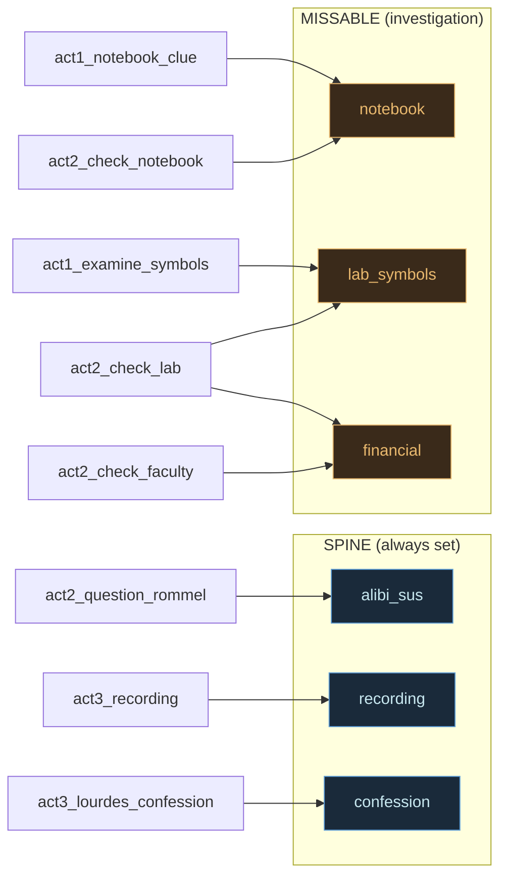
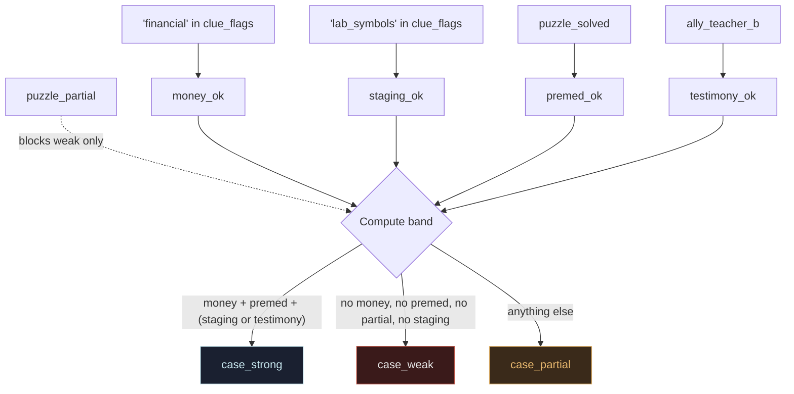
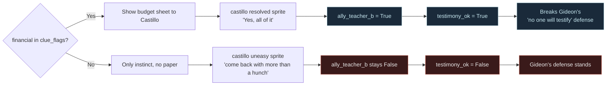
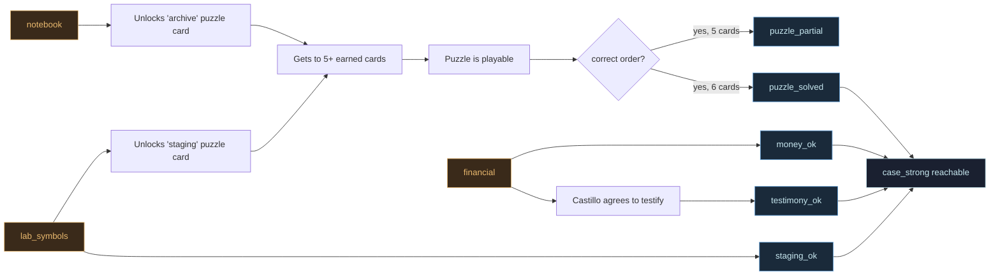

# 02 - Clues and Case Strength

Four charts: which scene sets which flag, how case strength is computed, the
`financial → testimony` causal rewire, and the full input-to-outcome matrix.

## 1. Clue Flag Map - Where Each Flag Is Set

Three "spine" clues are always set on a normal playthrough. Three "missable"
clues depend on which choices the player made.

## 2. Case strength computation

Four booleans are derived at the top of `act4_intro`, then collapsed into one
of three bands. Note that `puzzle_partial` blocks `case_weak` but does not
make a case strong.

## 3. Causal Rewire - `financial` to `Castillo` to `testimony`

`act3_ally_castillo` used to set `ally_teacher_b = True` unconditionally.
After the rewire, it only flips true when the player can show the money. This
is what makes a missed Act 2 location have real consequences three scenes
later.

## 4. Input Matrix - What Unlocks What

A compact view of how individual missable clues snowball through the system.

