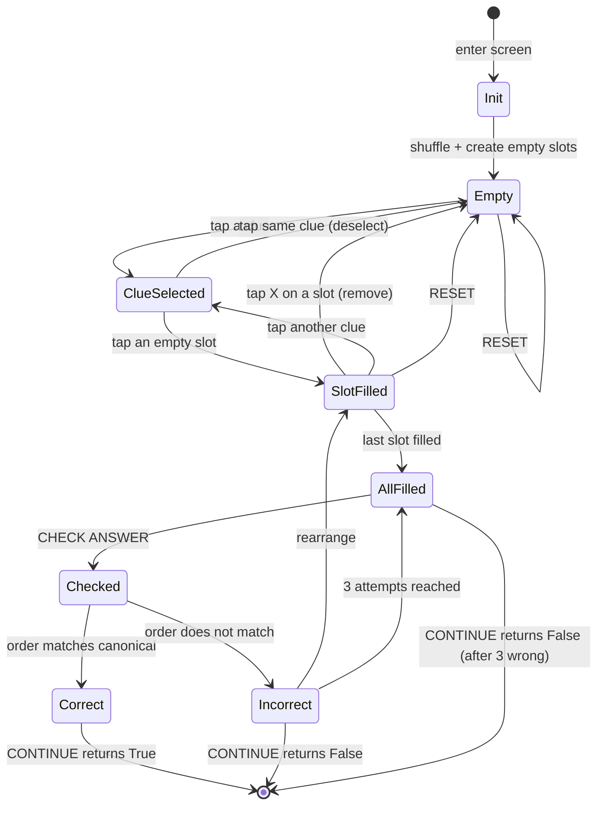
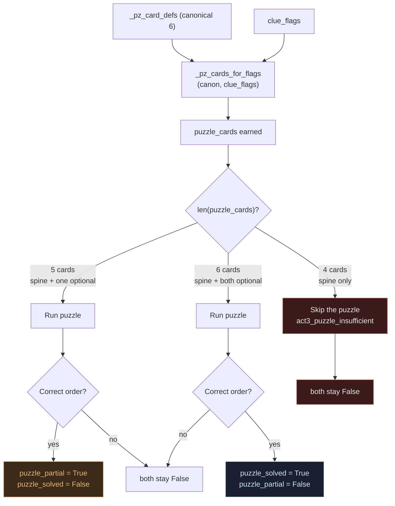
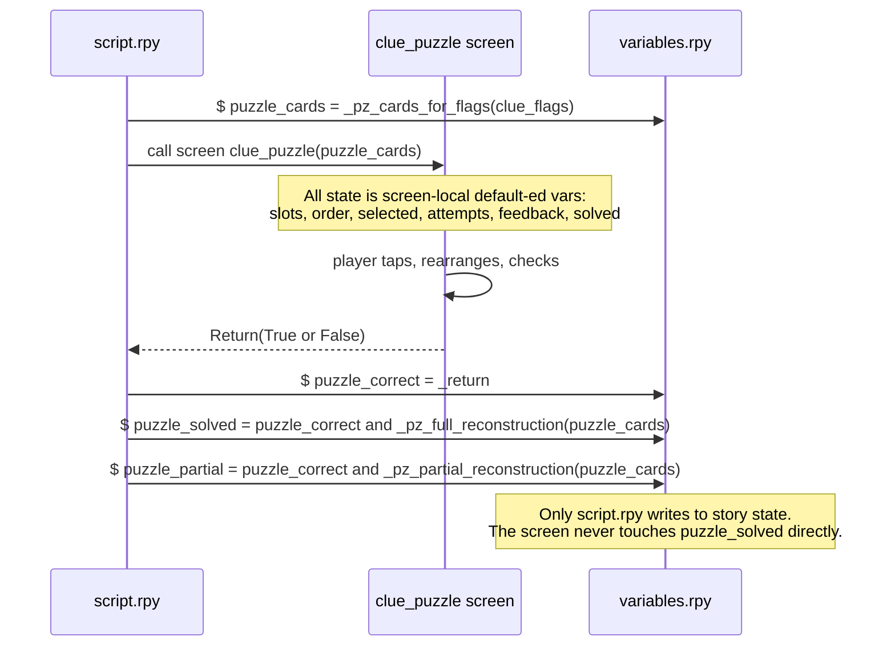

# Puzzle (Clue Reconstruction)

Three charts: the screen as a state machine, how the card list is filtered by
the earned flags, and the contract between the puzzle screen and the story.

## 1. Puzzle screen state machine

All UI state is screen-local (held in `default`-ed screen variables). The
screen never mutates story state — it returns `True` or `False`, and
`script.rpy` interprets that.

## 2. Card filtering by earned flags

The canonical card list has six entries. `_pz_cards_for_flags(clue_flags)`
filters them down to only what the player has earned — and the resulting
count decides what kind of puzzle (or no puzzle) runs.

## 3. Screen ↔ story contract

The puzzle screen is a UI component, not a story owner. This is what keeps
the puzzle replayable, rollback-safe, and inspectable from `script.rpy`.

