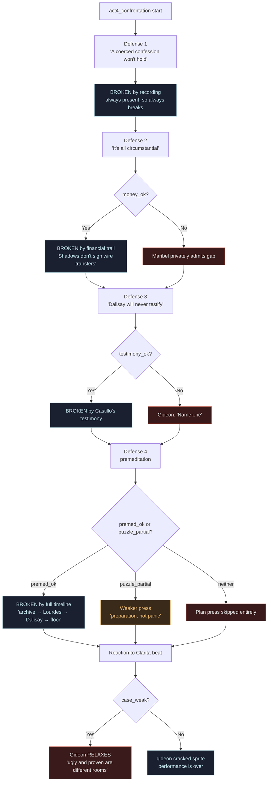
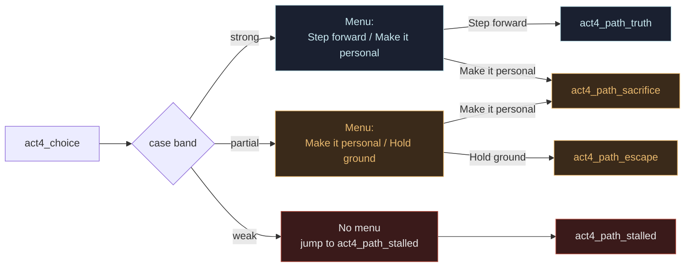
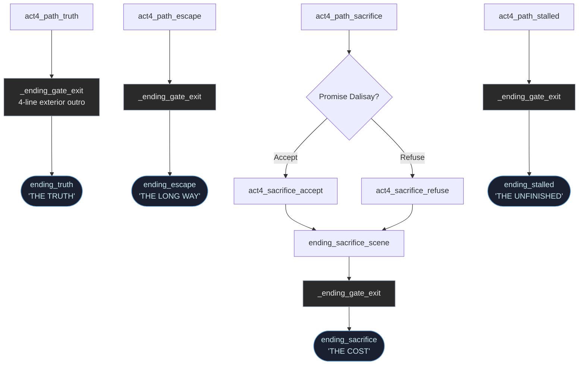

# 04 - Confrontation and Endings

Three charts: which evidence breaks which of Gideon's defenses on the rooftop,
which choice menu the player gets per case band, and the full ending dispatch.

## 1. Rooftop Rebuttals - What Each Defense Requires

The confrontation is structured as four defenses. Each one is broken only by
the matching evidence. The tape always lands (it's a spine clue); everything
else is conditional.

## 2. Choice menu per case band

The menu the player sees at `act4_choice` is gated by the band. Weak case
gets no menu — the "choice" was already made by under-investigating in Act 2.

## 3. Full ending dispatch with shared exit helper

All four endings funnel through `_ending_gate_exit` for the four-line outro
over the exterior shot, then jump to their title-card label.

