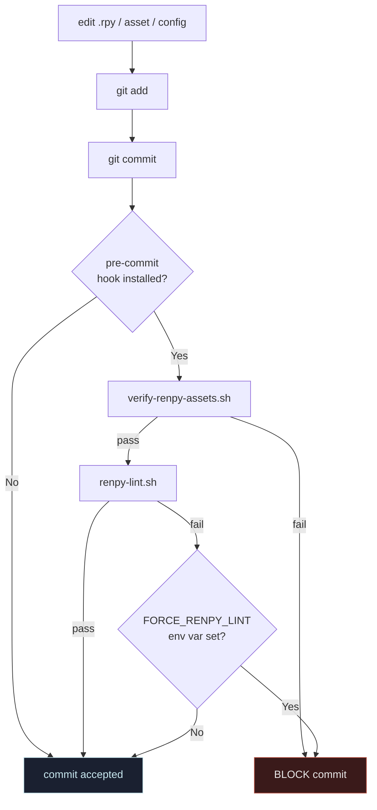
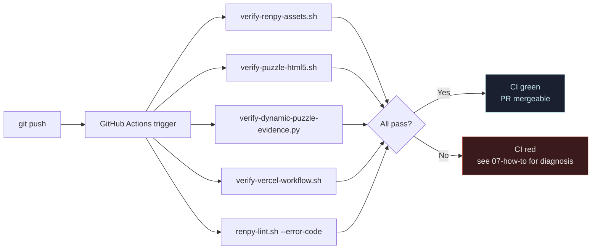
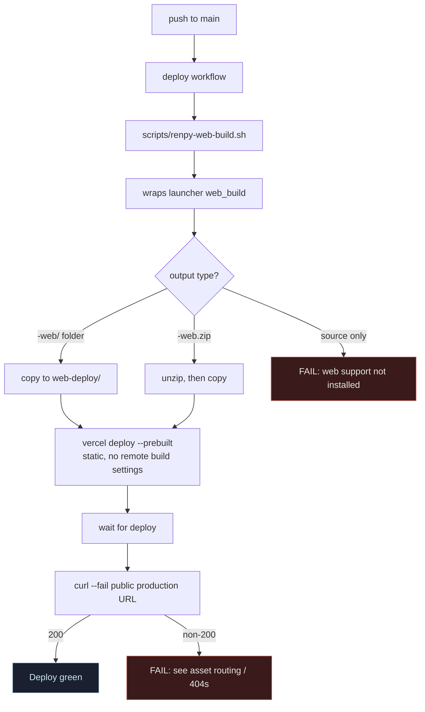
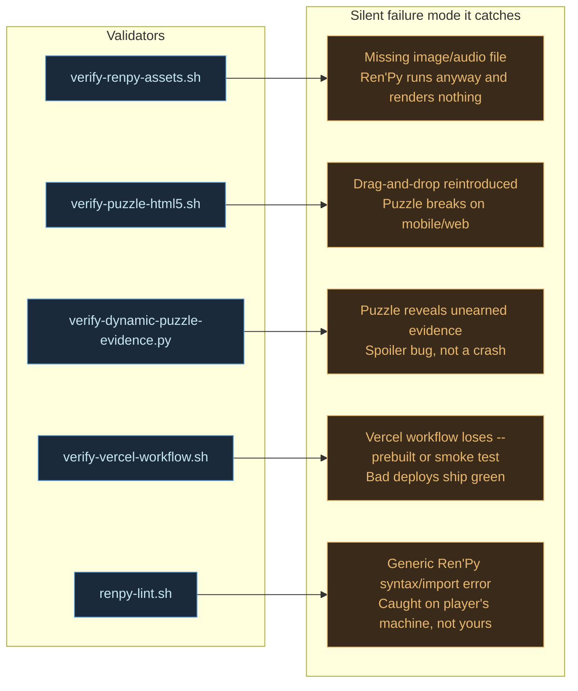

# Build and CI

Four charts: local pre-commit, CI lint job, web build + Vercel deploy, and a
coverage map of which validator protects which silent-failure mode.

## 1. Local pre-commit flow

Optional, opt-in via `./scripts/setup-git-hooks.sh`. CI runs the same checks
regardless, but the hook catches issues before they ever reach the remote.

## 2. CI lint workflow

Runs on every push and PR to `main` via `.github/workflows/renpy-lint.yml`.
Independent jobs run in parallel; any failure fails the whole workflow.

## 3. Web build and Vercel deploy

Runs on push to `main` via `.github/workflows/renpy-vercel-deploy.yml`. The
smoke test is the last line of defense — it actually hits the deployed URL.

## 4. Validator coverage — which script protects what

Each validator exists because some silent-failure mode would otherwise ship.
This is the design principle: every silent failure mode gets a loud validator.

