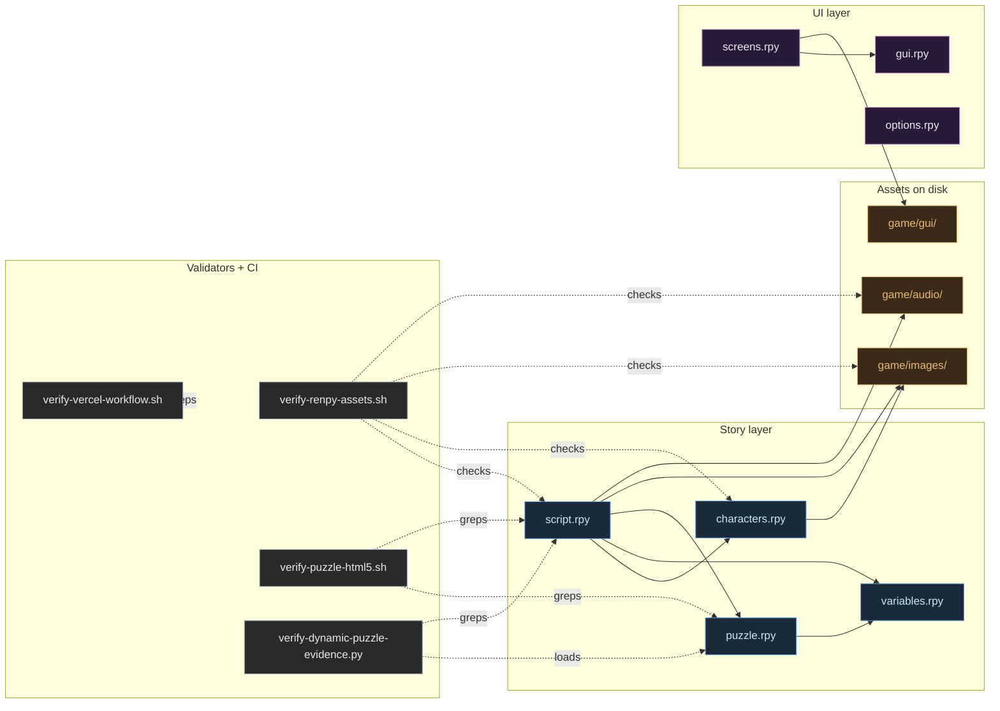
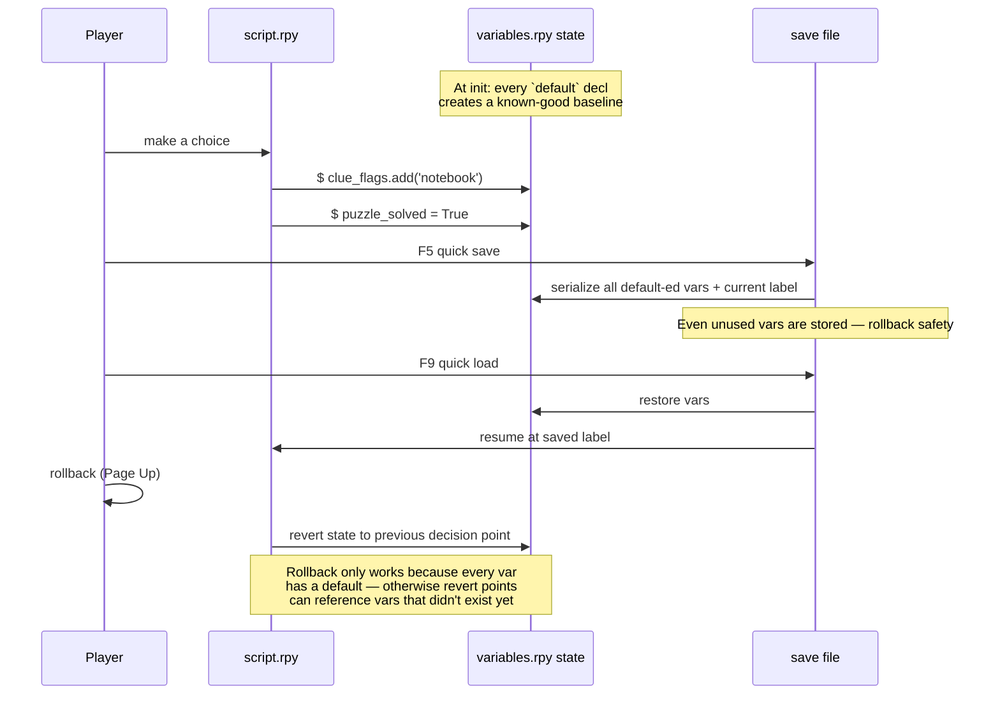
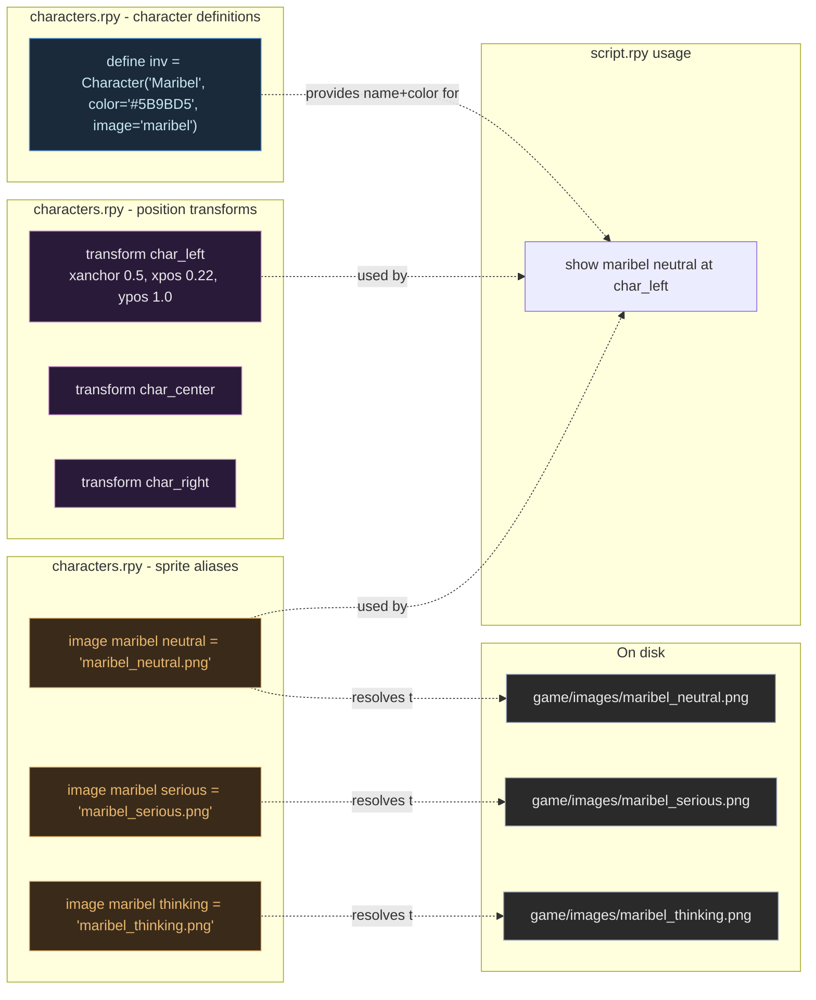

# Architecture

Three charts: file dependency graph (what reads what), the save/load state
lifecycle, and the character + sprite + position system.

## 1. File dependency graph

Solid arrows are "this file reads from / depends on that file." Most logic
flows out of `script.rpy`; everything else is supporting infrastructure.

## 2. Save / load / rollback lifecycle

Every variable the story reads must be declared with `default` in
`variables.rpy`. This is what makes saves, quick-loads, and rollback
all work without "variable does not exist" crashes.

## 3. Character + sprite + position system

Three layers of indirection let an artist rename a file without touching
`script.rpy`. Worth understanding because it's the single most reused
pattern in the codebase.

