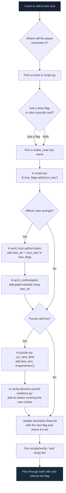
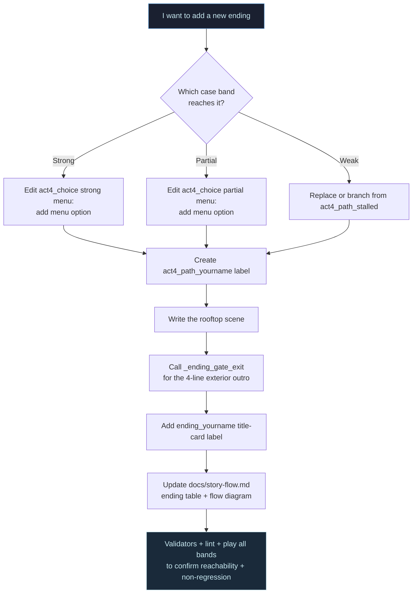
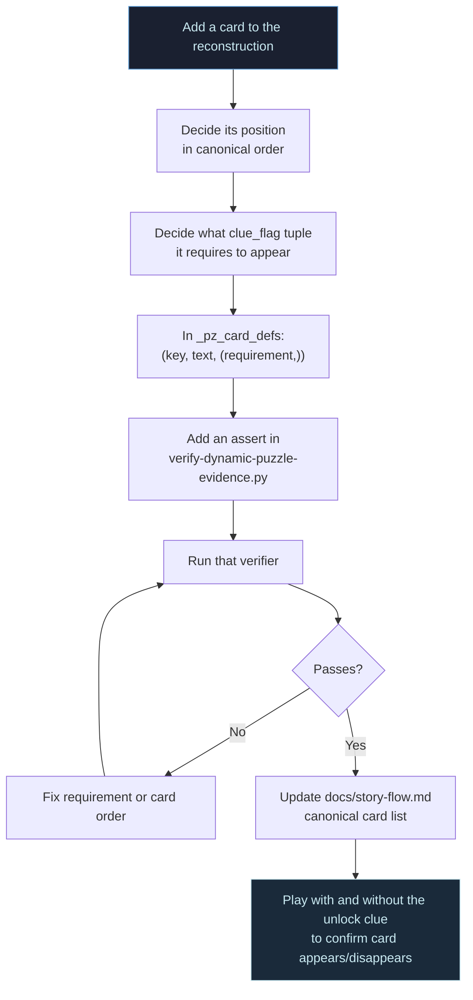
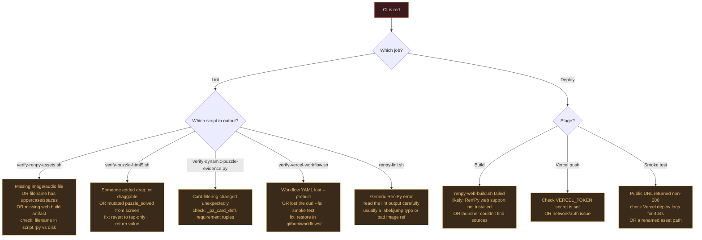
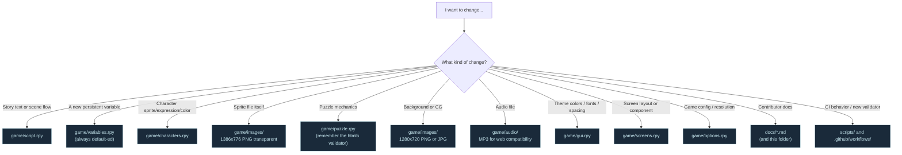

# 07 - How-To Decision Trees

Five charts for the most common contributor tasks. Each one starts with the
question you're trying to answer and ends with concrete files to touch.

## 1. Adding a new clue

Covers the "I want the player to find a new piece of evidence" case. Decide
upfront whether it's just a story flag or also a puzzle card — the answers
fan out from there.

## 2. Adding a new ending

Bigger change than a clue — touches Act 4 dispatch, gating, and docs.

## 3. Adding a new puzzle card

Most contained of the three. Mostly a `puzzle.rpy` change plus one verifier
assert. The story doesn't need to know.

## 4. Diagnosing a CI failure

When CI goes red, this is the fastest path from "which script failed?" to
"what's the actual problem?"

## 5. Which file do I edit?

Quick router when you know what you want to change but aren't sure where the
levers are.

