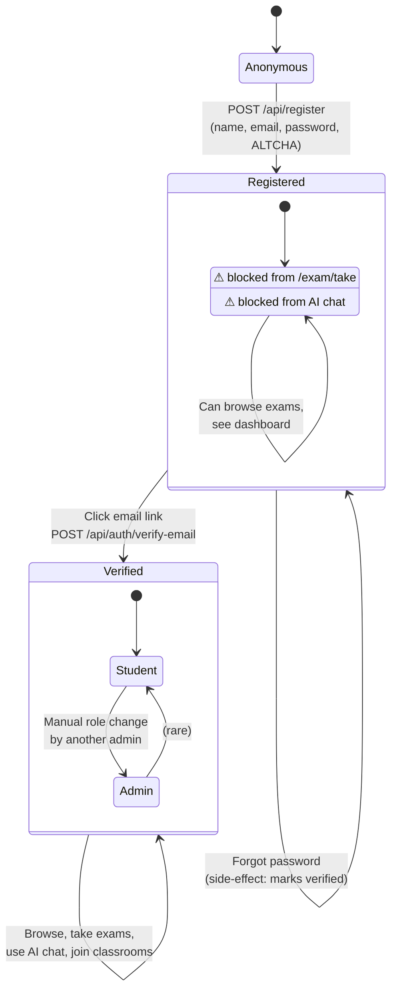

# 03 - User Lifecycle

The states a user account moves through, from first-time visitor to fully-onboarded student. Useful when you're reasoning about what a given user *can* and *can't* do.

## Diagram

## Notes

- **Unverified users can register and sign in**, but the timed-exam route and AI chat route both check `session.user.emailVerified` and reject.
- **Password reset side-effect**: completing a password reset also marks the email as verified. The reasoning is they clicked a link that landed in their inbox, which is itself proof of email ownership.
- **No "deleted" terminal state in the model.** Admin deletes are hard deletes via a `prisma.$transaction` that cleans up `QuestionResponse`, `ExamAttempt`, then `User`.
- **Self-deletion is blocked.** The `/api/admin/users/[userId]` DELETE handler refuses to remove `session.user.id`.
- **Admin role is set via DB**, never via the API. There's no "promote to admin" endpoint by design.
