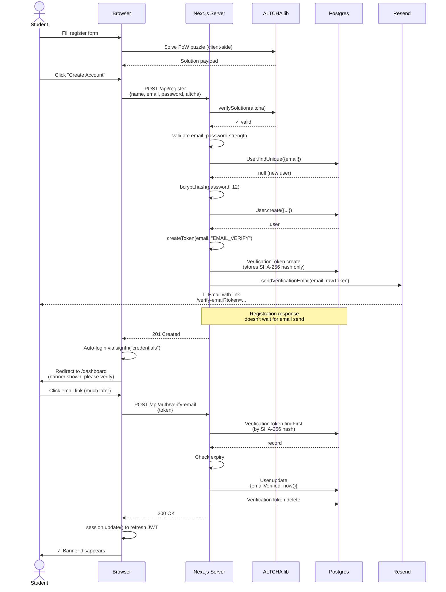

# 06 - Registration and Email Verification

The full path from "I'm new here" to "I have a verified account." Spans `app/register/page.tsx`, `app/api/register/route.ts`, `lib/tokens.ts`, `lib/email.ts`, and `app/verify-email/page.tsx`.

## Diagram

## Notes

- **The DB stores `SHA-256(token)`**, never the raw token. If the DB leaks, the leaked records can't be used as valid tokens.
- **Resend failure does NOT fail registration.** The registration handler wraps the email-send in try/catch and logs on failure — the user can always request a resend later.
- **Auto-login** happens client-side via NextAuth's `signIn("credentials", { redirect: false })` immediately after the registration POST succeeds.
- **The banner polls on `visibilitychange`** — when the user returns to the tab after clicking the email link, `update()` re-reads `emailVerified` from the DB.
- **Tokens expire after 24 hours** for `EMAIL_VERIFY`, 1 hour for `PASSWORD_RESET`.
