# 07 - Login Flow

What happens when an existing user signs in. Code lives in `app/login/page.tsx` and `lib/auth.ts`.

## Diagram

```mermaid
sequenceDiagram
  actor U as User
  participant B as Browser
  participant CHA as ALTCHA lib
  participant NA as NextAuth
  participant API as /api/altcha/verify
  participant DB as Postgres

  U->>B: Open /login
  B->>CHA: Solve PoW puzzle on mount
  CHA-->>B: Solution payload

  U->>B: Enter email + password,<br/>click "Sign In"

  B->>API: POST /api/altcha/verify {payload}
  API->>API: verifySolution(payload, HMAC_KEY)
  API-->>B: 200 OK

  B->>NA: signIn("credentials",<br/>{email, password, redirect: false})
  NA->>DB: User.findUnique({email})
  DB-->>NA: user record
  NA->>NA: bcrypt.compare(password, hash)

  alt password matches
    NA->>NA: Build session payload<br/>{id, email, name, role, emailVerified}
    NA->>NA: Sign JWT
    NA-->>B: Set session cookie
    B->>B: router.push(callbackUrl || "/dashboard")
  else password doesn't match
    NA-->>B: { error: "CredentialsSignin" }
    B->>U: Show "Invalid email or password"
  end
```

## Notes

- **ALTCHA is verified before NextAuth runs.** If the proof is invalid, we never even attempt the password check — saves DB load on bot traffic.
- **JWT strategy, not database sessions.** The session lives in the cookie itself. This avoids a DB lookup on every request. Trade-off: revoking sessions requires changing the JWT secret.
- **`emailVerified` is on the JWT.** That's why the banner and API guards can read it without a DB query. When verification status changes, we call `update()` client-side to re-sign the JWT.
- **`callbackUrl` is sanitized** — only relative paths starting with `/` are honored. Prevents open-redirect attacks via `?callbackUrl=https://evil.com`.
- **The auth callback in `lib/auth.ts`** controls which routes are public vs. gated, but each protected page also has its own `auth()` check (defense in depth).
