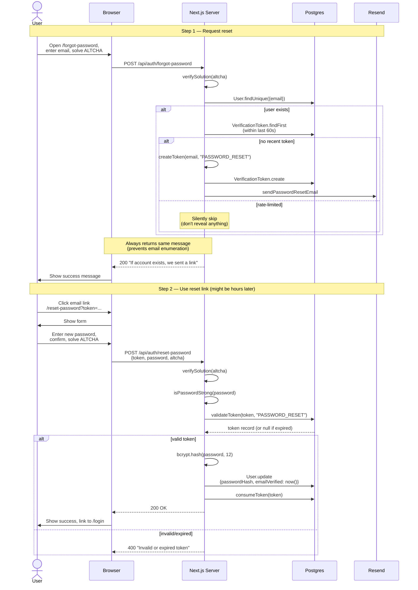

# 08 - Password Reset

Forgot-password flow end to end. Spans `app/forgot-password/page.tsx`, `app/api/auth/forgot-password/route.ts`, `app/api/auth/reset-password/route.ts`, and `app/reset-password/page.tsx`.

## Diagram

## Notes

- **Email enumeration protection** — the response is identical whether the email exists or not. The 60-second rate limit also doesn't leak existence.
- **Successful reset also verifies the email.** Clicking the link is proof of inbox access, so we don't make them re-verify separately.
- **Tokens are single-use** — `consumeToken` deletes the row inside the same flow. Even if the user clicks the link twice, the second click fails.
- **No session is invalidated on password reset.** This is a known gap — if an attacker is currently logged in with the old password, they stay logged in. We accept this because JWT revocation is expensive and the threat model assumes the attacker doesn't have the JWT.
