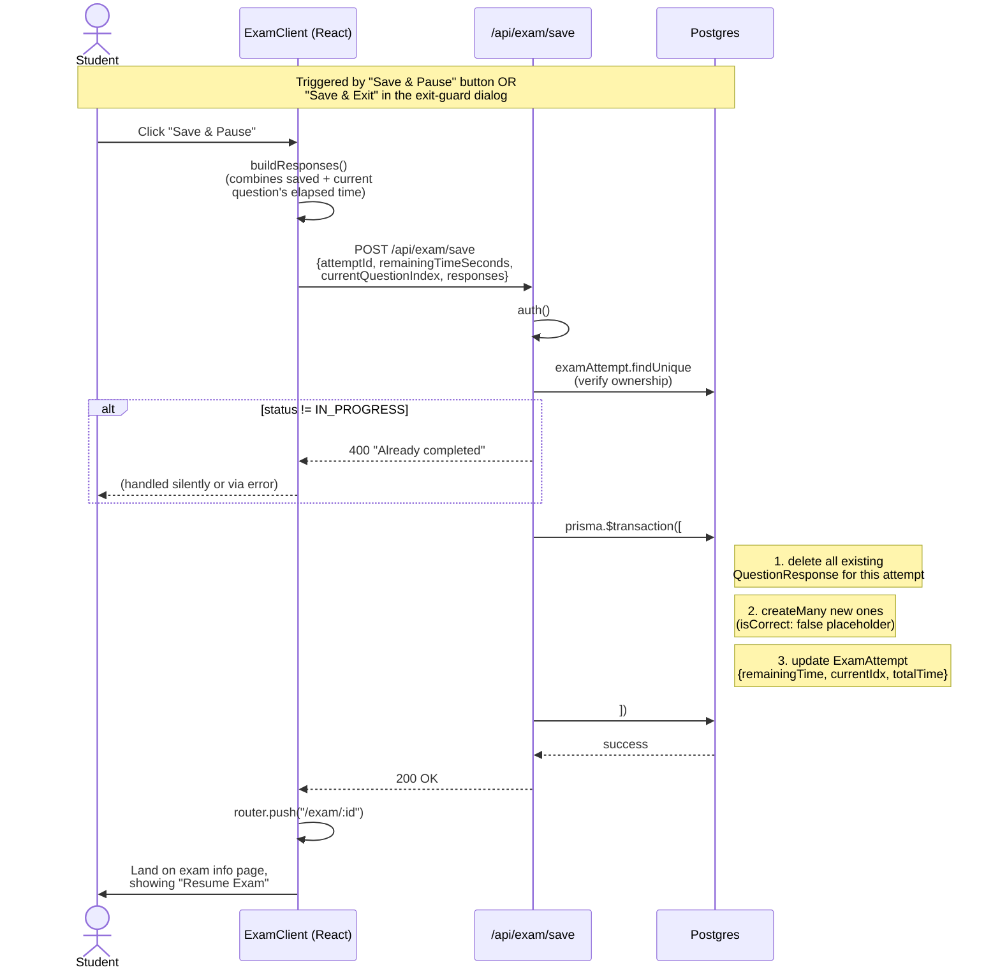

# 10 - Save and Pause

How an in-progress exam attempt persists its state. Code lives in `app/exam/[examId]/take/exam-client.tsx` (the client) and `app/api/exam/save/route.ts` (the API).

## Diagram

## Notes

- **Responses are replaced, not merged.** We delete then `createMany`. This is simpler and avoids tricky diff logic, and the response count is bounded (≤ totalQuestions).
- **`isCorrect` is set to `false` placeholder on save.** It gets recomputed on final submit. We don't grade until submission to avoid leaking correctness via timing or DB inspection.
- **`buildResponses` adds in the current question's unsaved elapsed time** without calling `recordQuestionTime` — that uses `setState` which is async and would give stale values.
- **The timer's `timeLeftRef`** is what gets sent as `remainingTimeSeconds`. We use a ref (not state) so the timer's per-second re-renders don't trigger a re-render of the whole exam component.
- **Submit reuses this same delete-then-createMany pattern**, but also sets `status: COMPLETED` and the real `isCorrect` values.
