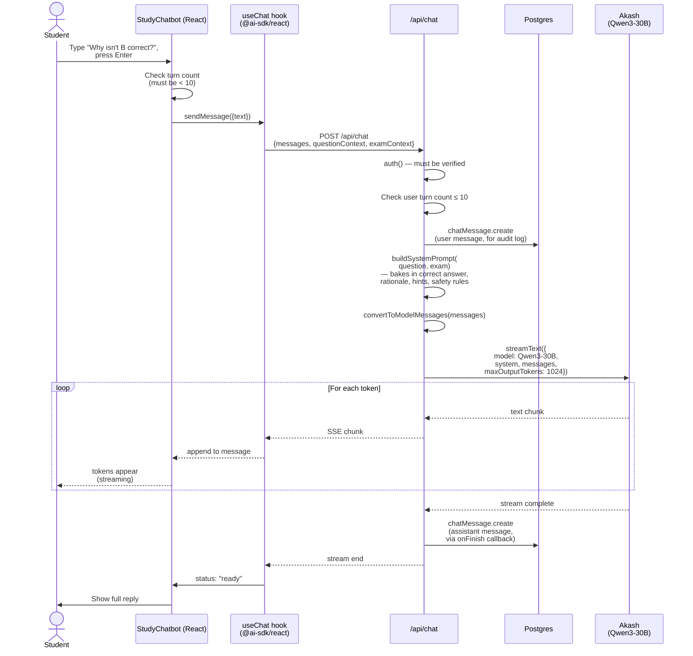

# 13 - AI Chat Request Flow

A single student message in Study Mode's AI tab, from typing to streamed response. Code: `components/study-chatbot.tsx` and `app/api/chat/route.ts`.

## Diagram

## Notes

- **The system prompt is rebuilt every request** with the full question context. The model never has to "remember" the question across turns — it's always re-injected.
- **Both user and assistant messages are logged** to `ChatMessage`. Disclosed to users in the UI: "💡 Chat messages are logged…"
- **Turn limit is enforced on BOTH ends.** Client disables input at 10; server rejects with 429 if a manipulated client tries to send more. Defense in depth.
- **Akash streams via SSE** through Vercel AI SDK. The `result.toUIMessageStreamResponse()` does all the protocol work.
- **`useMemo` on `transport`** is keyed on `(question.id, exam.id)`. Changing questions creates a new transport, effectively resetting the conversation.
- **The "loading bubble"** is shown until the first text token arrives — not when `status` becomes `streaming`. This avoids a visual flash where the bubble vanishes before the text appears.
