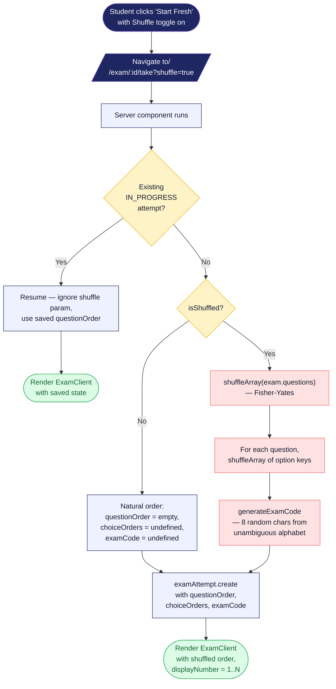
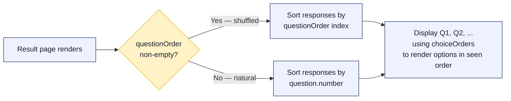

# 14 - Shuffled Exam Construction

How the `?shuffle=true` query param turns into a uniquely-ordered attempt with a shareable exam code. Code lives at the bottom of `app/exam/[examId]/take/page.tsx`.

## Diagram

## Result-page reconstruction

## Notes

- **Exam code alphabet** excludes `0`, `O`, `1`, `I`, `L` — anything visually ambiguous when read aloud or written down.
- **Shuffle is per-attempt**, not per-user. Taking the same exam twice with shuffle gives you two different orderings.
- **`choiceOrders` is a `{ questionId: [originalKey, ...] }` map.** The array indexes display order; values are the original (`"a"`, `"b"`, ...) keys for looking up text and hints.
- **`displayNumber` is computed at render time** — the DB never stores "this question was shown as Q5." It's always derivable from `questionOrder.indexOf(questionId) + 1`.
- **Once an attempt is shuffled, it stays shuffled.** Resuming a shuffled attempt re-applies the saved order; you can't accidentally "unshuffle" mid-exam.
