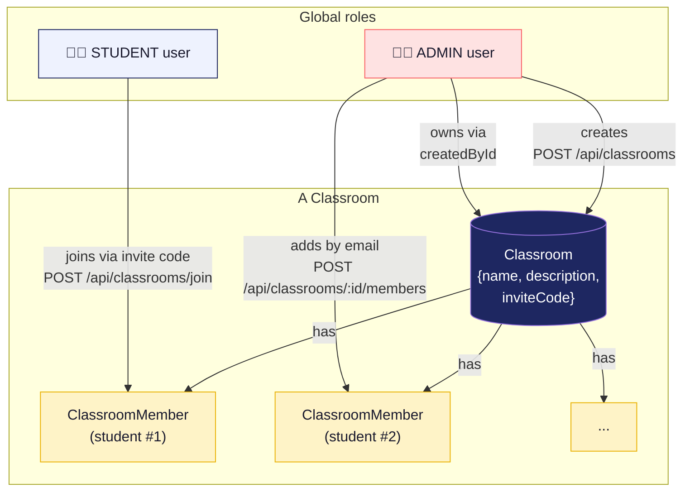
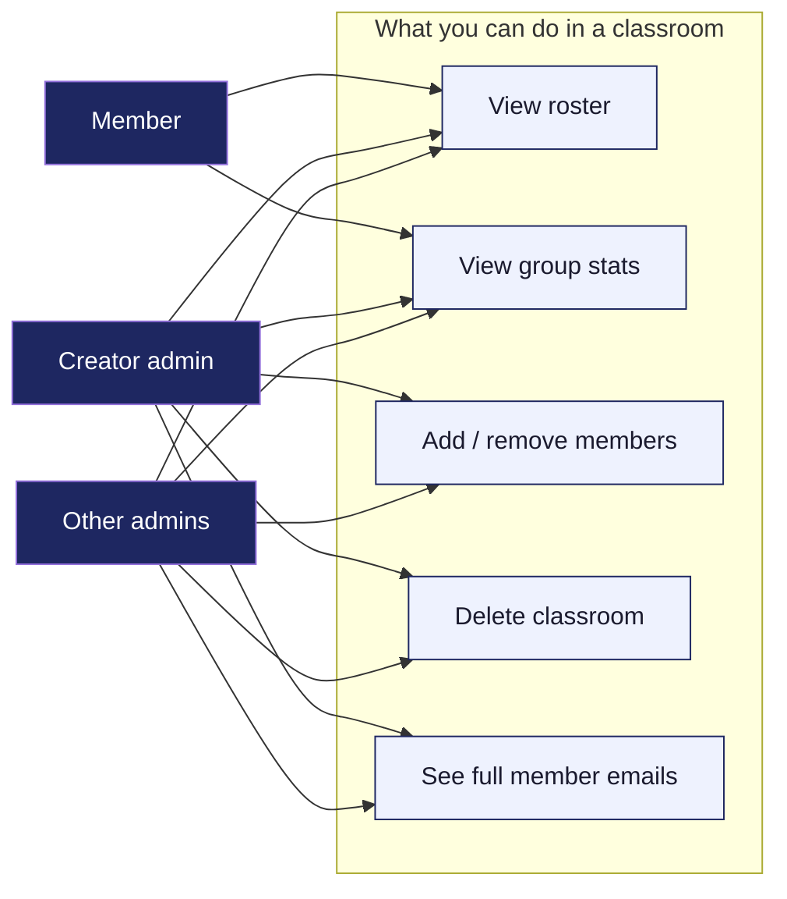

# 17 - Classroom Roles

How users, classrooms, and the join paths fit together. The schema has only two role enums (`STUDENT`, `ADMIN`), but classrooms add a per-classroom membership layer.

## Diagram

## Permission matrix

## Notes

- **Members see *redacted* emails** of other members (e.g. `m•••••a@example.com`) — only their own email is shown in full. See `lib/email-redact.ts`.
- **There's no "co-admin" or "moderator" role per classroom.** It's binary: admin (global) or member.
- **Deleting a user is blocked if they created classrooms** — they'd orphan all the members. The admin has to reassign or delete the classrooms first.
- **Invite codes are 6 chars from a safe alphabet** (no ambiguous chars) — see `lib/invite-code.ts`. Collisions are retried up to 3 times on `P2002` unique-constraint errors.
- **A user can be in many classrooms.** The stats label adapts: "Classroom Avg" for one, "Classrooms Avg" for multiple, "All Students" for none.
