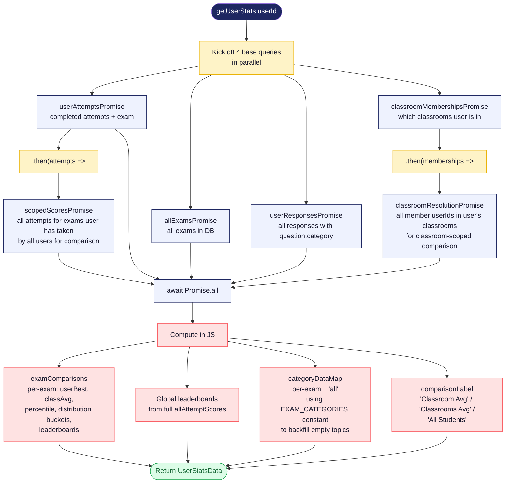

# 18 - Stats Aggregation

How `getUserStats(userId)` in `lib/stats/get-user-stats.ts` builds the payload that powers `/my-stats`. It's data-heavy but kept fast by issuing queries in parallel and chaining dependent ones off their prerequisites.

## Diagram

## Why this shape

| Approach | Why we chose it |
|---|---|
| Parallel queries | Avoids serial waterfalls. 4 base queries fire together; dependent ones fire as soon as their prerequisite resolves. |
| Compute aggregates in JS, not SQL | The per-user dataset is small (typically < 200 attempts). Easier to read and modify than complex window-function SQL. |
| Backfill canonical categories | Showing only attempted topics hides the gaps. `EXAM_CATEGORIES` from `lib/exam-categories.ts` has the official syllabus; we use it to seed empty categories with `correctRate: -1`. |
| Compute classroom vs global separately | We can't filter on the way down because we want the global leaderboard regardless of classroom membership. |

## Notes

- **`-1` is the "no data" sentinel** for category correctRate. The chart component (`CategoryChart`) renders these as "No data" rather than 0%, so unattempted topics don't look like terrible performance.
- **The classroom-scoped view is automatic.** No toggle; if you're in a classroom, your comparison defaults to classroom.
- **Categories are sorted by chapter-section prefix** (e.g. `"8-2"` parses to `[8, 2]`), so the chart matches the official syllabus order rather than alphabetical.
- **No caching.** The function runs on every `/my-stats` render. Acceptable because page renders are infrequent and the queries are indexed.
