# 19 - Server vs Client Component Decision

When you're adding a new component, this is the decision tree we use. The default is **server component** — only reach for `"use client"` when you have a concrete reason.

## Diagram

```mermaid
flowchart TD
  Start([I'm building a new component]) --> Q1{Does it need<br/>interactivity?<br/>onClick, onChange,<br/>useState, useEffect}

  Q1 -->|No| Server1[Server component<br/>No directive at top]
  Server1 --> S1End([Fetch data directly with<br/>Prisma / await])

  Q1 -->|Yes| Q2{Can the parent<br/>be a server<br/>component?}

  Q2 -->|Yes| Hybrid[Server component parent<br/>passes data as props<br/>to a small client child]
  Hybrid --> HEnd([Best of both —<br/>fetch on server,<br/>interactivity on client])

  Q2 -->|No| Q3{Are you doing<br/>data fetching<br/>inside?}

  Q3 -->|Yes — for personal data| API[Client component +<br/>fetch&#40;'/api/...'&#41;]
  API --> APIEnd([Add a route handler<br/>that does the prisma query])

  Q3 -->|Yes — for AI / streaming| Stream[Client component +<br/>useChat / useCompletion]
  Stream --> StreamEnd([Server route does<br/>streamText&#40;...&#41;])

  Q3 -->|No| Pure[Pure client component<br/>'use client' at top]
  Pure --> PureEnd([useState, refs,<br/>browser APIs only])

  classDef start fill:#1E2761,color:#FFFFFF
  classDef decision fill:#FEF3C7,color:#1A1A2E,stroke:#EAB308
  classDef server fill:#DCFCE7,color:#166534,stroke:#16A34A
  classDef client fill:#FEE2E2,color:#1A1A2E,stroke:#F96167
  classDef hybrid fill:#EEF2FE,color:#1A1A2E,stroke:#1E2761

  class Start start
  class Q1,Q2,Q3 decision
  class Server1,S1End server
  class Pure,PureEnd,API,APIEnd,Stream,StreamEnd client
  class Hybrid,HEnd hybrid
```

## Examples from the codebase

| Component | Type | Why |
|---|---|---|
| `app/dashboard/page.tsx` | Server | Pure data fetch + render. No interactivity. |
| `app/exam/[examId]/take/page.tsx` | Server | Fetches exam + maybe-existing attempt, then hands off to a client. |
| `app/exam/[examId]/take/exam-client.tsx` | Client | Timer, selections, navigation — all stateful. |
| `components/exam-card.tsx` | Server | Just renders props. No state. |
| `components/study-chatbot.tsx` | Client | Uses `useChat` from AI SDK. |
| `components/email-verification-banner.tsx` | Client | Calls `useSession`, polls on tab focus. |
| `app/admin/exams/[examId]/edit/exam-editor.tsx` | Client | Massive form state. Parent is a server component that fetches the questions. |

## Rules of thumb

- **A client component CAN import a server component**, but only via the children prop. You can't `import` a server component into a client one directly.
- **Suspense boundaries belong in the server tree.** Wrap heavy server-rendered sections; use `loading.tsx` for the route-level case.
- **Don't sprinkle `"use client"` "just in case."** Every `"use client"` is a chunk of JS shipped to every visitor. Real cost.
- **Route handlers (`route.ts`) are always server-side.** They're how client components get to the DB.

## Notes

- The whole point of RSC is that the default is server. If you find yourself reaching for `"use client"` on most new components, take it as a smell — you might be coupling presentation and interactivity too tightly.
- For form-heavy admin pages, the pattern is: server page fetches initial data → client editor handles all state → POST to a route handler on save.
